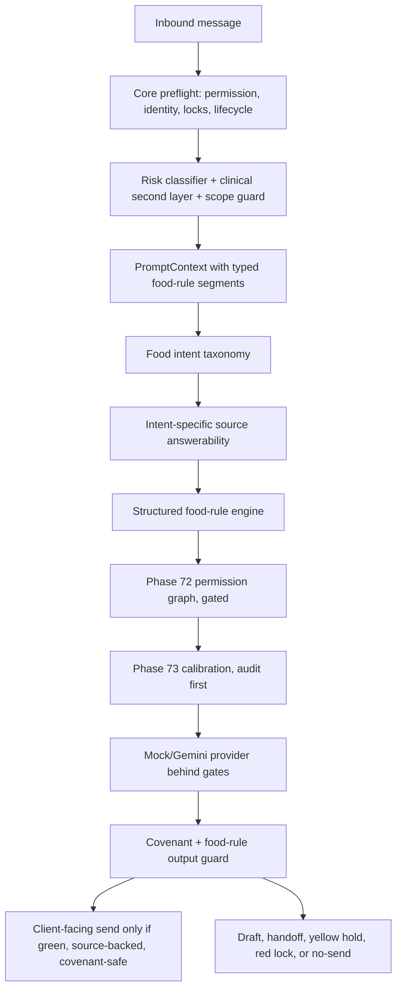

# MANU-AI Food-Rule Green Capacity Expansion Plan

## Confidence Position

Bu plan mevcut kod ve doküman analizi üzerine kuruldu. Mutlak anlamda `%100 garanti` verilemez; çünkü klinik taksonomi, resmi kaynak korpusu, yasal/privacy onayları ve WhatsApp/Gemini üretim koşulları dış onaylara bağlı. Ancak mühendislik açısından plan fail-closed, test-first ve launch-gate uyumlu tasarlandı. Planın temel ilkesi: yeşil kapasiteyi sadece açık, yapılandırılmış, onaylı kaynaklarla genişletmek; klinik yorumu, plan değişikliğini, belirsiz ürünü ve mixed-intent mesajları yeşile taşımamak.

Mevcut sistemde kullanılacak ana temel dosyalar:

- Core orchestrator: [dietitian-ai-assistant/src/orchestrator.js](c:/Users/Dell/OneDrive/Masaüstü/MANU-AI/dietitian-ai-assistant/src/orchestrator.js)
- Approved source answerability: [dietitian-ai-assistant/src/approved-source-answerability.js](c:/Users/Dell/OneDrive/Masaüstü/MANU-AI/dietitian-ai-assistant/src/approved-source-answerability.js)
- Green intent taxonomy: [dietitian-ai-assistant/src/green-intent-taxonomy.js](c:/Users/Dell/OneDrive/Masaüstü/MANU-AI/dietitian-ai-assistant/src/green-intent-taxonomy.js)
- Clinical second layer: [dietitian-ai-assistant/src/clinical-safety-second-layer.js](c:/Users/Dell/OneDrive/Masaüstü/MANU-AI/dietitian-ai-assistant/src/clinical-safety-second-layer.js)
- PromptContext compiler: [dietitian-ai-assistant/src/context-compiler.js](c:/Users/Dell/OneDrive/Masaüstü/MANU-AI/dietitian-ai-assistant/src/context-compiler.js)
- Form registry: [app/src/lib/phase-70-form-registry.ts](c:/Users/Dell/OneDrive/Masaüstü/MANU-AI/app/src/lib/phase-70-form-registry.ts)
- Form hardening: [app/src/lib/phase-70-form-hardening.ts](c:/Users/Dell/OneDrive/Masaüstü/MANU-AI/app/src/lib/phase-70-form-hardening.ts)
- Client forms: [app/src/lib/client-forms.ts](c:/Users/Dell/OneDrive/Masaüstü/MANU-AI/app/src/lib/client-forms.ts)
- Update proposals: [app/src/lib/client-update-proposals.ts](c:/Users/Dell/OneDrive/Masaüstü/MANU-AI/app/src/lib/client-update-proposals.ts)
- Permission graph: [app/src/lib/phase-72-permission-graph.ts](c:/Users/Dell/OneDrive/Masaüstü/MANU-AI/app/src/lib/phase-72-permission-graph.ts)
- Calibration: [app/src/lib/phase-73-health-regulation-calibration.ts](c:/Users/Dell/OneDrive/Masaüstü/MANU-AI/app/src/lib/phase-73-health-regulation-calibration.ts)
- Phase 74 lifecycle: [app/src/lib/phase-74-data-lifecycle-policy.ts](c:/Users/Dell/OneDrive/Masaüstü/MANU-AI/app/src/lib/phase-74-data-lifecycle-policy.ts)

## Non-Negotiable Product Laws

- Yeşil cevap yalnızca onaylı kaynakla desteklenmişse verilir.
- AI kimliği, “ben AI’yım”, “doktora/diyetisyene danış”, “tıbbi tavsiye veremem” gibi client-facing ifadeler yasaktır.
- Sarı/kırmızı durumlarda client-facing AI boundary reply yoktur.
- Mixed-intent fail-closed çalışır: mesajın herhangi bir parçası sarı/kırmızı ise kısmi yeşil cevap gönderilmez.
- AI-generated geçmiş mesajlar klinik kaynak otoritesi değildir.
- Form, diyet planı, diyetisyen manuel mesajı, pinned note, Critical Context ve onaylı resmi kaynaklar kaynak otoritesidir.
- Gerçek Gemini, WhatsApp, Telegram, monitoring, secret manager ve gerçek sağlık verisi kapalı kalır.
- Production pilot bu track boyunca `NO-GO` kalır.

## Target Architecture

## Current Gaps Found

- `approved-source-answerability` şu anda “herhangi bir onaylı kaynak var mı?” seviyesinde çalışıyor; “bu besin sorusunu bu spesifik alan destekliyor mu?” ayrımı yok.
- `client_form_summary` tek blob olarak PromptContext’e giriyor; `allowed_substitutions`, `forbidden_substitutions`, `diet_type`, `optional_foods` gibi alanlar ayrı kanıt segmentleri değil.
- `green-intent-taxonomy` substitution ve plan lookup gibi intentleri tanıyor ama intent ile zorunlu kaynak türünü bağlamıyor.
- Clinical second layer alerji/kısıtlı besin geçen mesajları sarıya yükseltebiliyor; bu, “süt yasak, sütlü çikolata yemeyelim” gibi kaynaklı yeşil retleri engelleyebilir.
- Phase 72 permission graph ve Phase 73 calibration draft durumda; orchestrator hot path’e bağlı değil.
- Ürün içerik doğrulama katmanı yok; açık web araması güvenli kaynak sayılmamalı.
- Formlarda bazı besin alanları var ama yeterince yapılandırılmış değil; özellikle besin grubu, eşdeğer değişim, opsiyonel/zorunlu tüketim, diyet tipi uyumluluğu ve alerjen anahtarları eksik.
- Form ile `ClientRecord.allergies` / `restrictedFoods` arasında drift riski var.
- Dashboard form UX’i registry’nin gücünü tam kullanmıyor; geniş besin kuralları için özel yönetim yüzeyi gerekir.
- Phase 74 export/anonymization yeni besin kuralı verilerini kapsayacak şekilde genişletilmeli.

## Phase 76C - PRD and Technical Spec Lock

Amaç: Bu büyük değişikliği WhatsApp adapter’dan önce ayrı bir klinik answerability fazı olarak kilitlemek.

Yapılacaklar:

- Yeni spec dosyası oluştur: `docs/PHASE_76C_STRUCTURED_FOOD_RULE_GREEN_CAPACITY_SPEC.md`.
- Kapsamı netleştir: yapılandırılmış besin kuralları, intent-specific answerability, food-rule engine, ürün içerik doğrulama contract’ı, golden cases, DSAR kapsamı.
- Non-goal’ları açık yaz: gerçek Gemini yok, gerçek WhatsApp yok, web scraping yok, yeni klinik karar yok, production GO yok.
- Edge case matrisi yaz: yasaklı besin, izinli besin, eşdeğer değişim, diyet tipi uyumsuzluğu, opsiyonel öğün atlama, zorunlu öğün, belirsiz ürün, alerjenli ürün, mixed-intent, semptom, ilaç, lab, pregnancy, minor, eating disorder.
- Direct 100 planında Phase 76C’yi WhatsApp production adapter’dan önce konumlandır.

Done criteria:

- Spec, scope, non-goals, edge cases ve test planı tamamlanır.
- Production pilot `NO-GO` kalır.
- Değişiklik başlamadan önce spec kabul edilir.

## Phase 76D - Structured Food Rule Data Model and Form Upgrade

Amaç: Diyetisyen ve client formlarını serbest metinden yapılandırılmış, denetlenebilir besin kurallarına taşımak.

Yeni alan aileleri:

- `forbidden_food_items`: tekil yasaklı besinler.
- `forbidden_food_groups`: süt ürünleri, gluten, kabuklu yemiş, kırmızı et, işlenmiş şeker gibi grup yasakları.
- `allowed_food_items`: açık izinli besinler.
- `allowed_food_groups`: izinli besin grupları.
- `diet_type_rules`: vegan, vejetaryen, ketojenik, düşük FODMAP, Akdeniz, diyabet planı gibi diyet tipi kuralları.
- `equivalent_exchange_groups`: badem/fındık/ceviz gibi aynı değişim grubundaki besinler.
- `mandatory_foods_or_meals`: kesin tüketilmeli öğeler.
- `optional_foods_or_meals`: atlanabilir veya esnek öğeler.
- `skip_tolerance_rules`: “bugünlük atlanabilir”, “haftada x kez esnek”, “atlanamaz” gibi kurallar.
- `portion_boundaries`: porsiyon artırmadan sadece mevcut limit hatırlatma.
- `ingredient_allergen_keywords`: süt, laktoz, whey, casein, peynir altı suyu gibi içerik anahtarları.
- `product_label_review_policy`: ürün etiketi, barkod, marka içeriği, kullanıcı fotoğrafı/metni üzerinden karar verilip verilemeyeceği.
- `uncertainty_policy`: emin değilse sarı/draft/handoff.

Kod etkisi:

- [app/src/lib/phase-70-form-registry.ts](c:/Users/Dell/OneDrive/Masaüstü/MANU-AI/app/src/lib/phase-70-form-registry.ts): yeni alanları ekle, registry version bump yap.
- [app/src/lib/phase-70-form-hardening.ts](c:/Users/Dell/OneDrive/Masaüstü/MANU-AI/app/src/lib/phase-70-form-hardening.ts): autopilot minimum field set’ini genişlet, structured food fields completeness kontrolü ekle.
- [app/src/lib/phase-70-seed-answers.ts](c:/Users/Dell/OneDrive/Masaüstü/MANU-AI/app/src/lib/phase-70-seed-answers.ts): demo seed’i yapılandırılmış besin kurallarıyla genişlet.
- [app/src/lib/client-forms.ts](c:/Users/Dell/OneDrive/Masaüstü/MANU-AI/app/src/lib/client-forms.ts): prompt summary yerine field-level manifest üret.
- [app/src/lib/types.ts](c:/Users/Dell/OneDrive/Masaüstü/MANU-AI/app/src/lib/types.ts): gerekirse structured field value tipleri ekle.

Data governance:

- Bu alanlar sağlık/veri kısıtı sayılır; `privacySensitivity` çoğunlukla high/critical olmalı.
- Prompt’a ham uzun serbest metin değil, sanitize edilmiş structured summary girmeli.
- Sensitive detail alanları `sensitive_never_prompt` kalmalı.

Testler:

- Form registry field classification testleri.
- Autopilot completeness testleri.
- Structured food field sanitization testleri.
- Seed qualification testleri.

Done criteria:

- Diyetisyen yapılandırılmış yasak/izin/eşdeğer/opsiyonel/zorunlu kuralları tanımlayabilir.
- Prompt-allowed alanlar sınırlı ve izlenebilir olur.
- Autopilot için gerekli besin kuralı alanları eksikse preflight block olur.

## Phase 76E - Food Rule Engine

Amaç: “Bu besin/ürün/alternatif bu danışanın onaylı kurallarıyla uyumlu mu?” sorusunu LLM’e bırakmadan deterministik değerlendirmek.

Yeni core veya app-core bridge modülü:

- Önerilen core modül: `dietitian-ai-assistant/src/food-rule-engine.js`.
- App tarafı bridge: `app/src/lib/food-rule-runtime.ts`.

Decision contract:

- `allowed_food_confirmation`: açıkça izinli.
- `forbidden_food_rejection`: açıkça yasaklı.
- `equivalent_substitution_allowed`: aynı onaylı değişim grubunda.
- `diet_type_compatible`: diyet tipiyle uyumlu.
- `diet_type_conflict`: diyet tipiyle çelişiyor.
- `optional_skip_allowed`: açık esneklik var.
- `mandatory_skip_blocked`: zorunlu öğe atlanamaz.
- `unknown_food_requires_review`: kaynak yok.
- `product_ingredient_conflict`: ürün içeriği yasaklı anahtar içeriyor.
- `product_ingredient_unknown`: içerik belirsiz.
- `mixed_intent_blocked`: plan dışı klinik istek içeriyor.

Deterministik kurallar:

- Yasak kuralı izin kuralından önce gelir.
- Alerji/medical restriction tercih kısıtından önce gelir.
- Mandatory rule optional rule’dan önce gelir.
- En yeni diyetisyen-authored source eski kaynağı geçer.
- AI-generated source otorite değildir.
- Belirsizlik sarıya gider.

Kod etkisi:

- Food rule engine, PromptContext segmentlerinden değil structured source manifest’ten beslenmeli.
- Engine sonucu `contextManifest.foodRuleDecision` içinde raw text olmadan tutulmalı.
- `providerAttempted=false` olan no-send/handoff durumları audit edilmeli.

Testler:

- Yasaklı besin sorusu: “x yersem olur mu?” -> green rejection.
- İzinli besin sorusu -> green confirmation.
- Onaylı eşdeğer: badem yerine fındık -> green confirmation.
- Eşdeğer olmayan alternatif -> yellow/draft.
- Diyet tipiyle çelişen besin -> green rejection veya yellow; klinik yoruma gerek yoksa green rejection.
- Opsiyonel öğün atlama -> green supportive response.
- Zorunlu öğün atlama -> green reminder/block veya yellow, kural tipine göre.
- Kaynak yok -> yellow/handoff.
- Mixed intent -> fail-closed.

Done criteria:

- LLM besin uyumluluğunu icat etmez; engine kararı üzerinden konuşur.
- Green cevaplar sadece explicit food-rule decision varsa açılır.

## Phase 76F - Intent-Specific Answerability Upgrade

Amaç: Phase 67’yi “herhangi bir kaynak var”dan “intent için doğru kaynak var” seviyesine çıkarmak.

Değişiklik:

- `green_allowed_substitution` için `allowed_substitutions` veya `equivalent_exchange_groups` gerekir.
- `green_forbidden_food_reminder` için `forbidden_food_items`, `forbidden_food_groups`, `restricted_foods_medical`, `allergies` veya `diet_type_conflict` gerekir.
- `green_allowed_food_confirmation` için explicit `allowed_food_items/groups` veya `diet_type_compatible` gerekir.
- `green_optional_meal_skip` için `optional_foods_or_meals` veya `skip_tolerance_rules` gerekir.
- `green_plan_lookup` için active diet plan veya meal slots gerekir.
- `green_general_education` için approved official corpus veya approved education source gerekir; aksi halde yellow/draft.

Kod etkisi:

- [dietitian-ai-assistant/src/green-intent-taxonomy.js](c:/Users/Dell/OneDrive/Masaüstü/MANU-AI/dietitian-ai-assistant/src/green-intent-taxonomy.js): yeni intent family’ler ekle.
- [dietitian-ai-assistant/src/approved-source-answerability.js](c:/Users/Dell/OneDrive/Masaüstü/MANU-AI/dietitian-ai-assistant/src/approved-source-answerability.js): intent input alacak veya orchestrator order intent-first olacak şekilde düzenle.
- [dietitian-ai-assistant/src/orchestrator.js](c:/Users/Dell/OneDrive/Masaüstü/MANU-AI/dietitian-ai-assistant/src/orchestrator.js): green intent evaluation önce, answerability sonra veya birleşik evaluator olacak şekilde güvenli sırayı kur.
- [app/src/types/dietitian-ai-assistant-architecture.d.ts](c:/Users/Dell/OneDrive/Masaüstü/MANU-AI/app/src/types/dietitian-ai-assistant-architecture.d.ts): yeni decision metadata tiplerini ekle.

Fail-closed behavior:

- Intent tanınmadıysa fallback yeşil cevap yok; düşük risk clarification ise kısa soru/draft olabilir.
- Kaynak yoksa provider çağrısı yok.
- Hassas intent varsa taxonomy block eder.

Testler:

- Per-intent source requirement unit tests.
- Orchestrator provider-attempt false tests.
- Simulator green/no-send tests.
- JSONL golden cases.

Done criteria:

- Substitution sorusu sadece substitution source ile yeşil olur.
- Yasaklı besin ret cevabı sadece restriction source ile yeşil olur.
- Genel plan kaynağı, her besin sorusuna blanket authority vermez.

## Phase 76G - Clinical Second-Layer False-Yellow Calibration

Amaç: Kaynaklı besin hatırlatma/ret cevaplarını gereksiz sarıya düşürmeden güvenliği korumak.

Sorun:

- Mevcut second layer alerji/kısıtlı besin geçtiğinde sarıya yükseltebiliyor.
- Bu güvenli ama yeni hedefte “süt yasak, bunu yemeyelim” gibi green rejection yollarını gereksiz bloklar.

Yeni ayrım:

- Acute allergy/severe symptom dili varsa red/yellow kalır.
- Alerjen sadece “bunu yiyebilir miyim?” bağlamında ve engine explicit forbidden decision verdiyse green rejection olabilir.
- “Yedim, kaşınıyorum/nefesim daralıyor” gibi durumlar red/yellow kalır.
- “İçinde süt olabilir mi bilmiyorum” -> ürün içerik belirsizse yellow.
- Known allergy + product ingredient conflict kesin ise green rejection mümkün; fakat allergy severity `Agir/anafilaksi` ise clinical reviewer kararına göre yellow olabilir.

Kod etkisi:

- [dietitian-ai-assistant/src/clinical-safety-second-layer.js](c:/Users/Dell/OneDrive/Masaüstü/MANU-AI/dietitian-ai-assistant/src/clinical-safety-second-layer.js): source-backed food-rule exception contract.
- [dietitian-ai-assistant/tests/clinical-second-layer-cases.jsonl](c:/Users/Dell/OneDrive/Masaüstü/MANU-AI/dietitian-ai-assistant/tests/clinical-second-layer-cases.jsonl): false-yellow ve severe allergy cases.
- [dietitian-ai-assistant/tests/clinical-golden-cases.jsonl](c:/Users/Dell/OneDrive/Masaüstü/MANU-AI/dietitian-ai-assistant/tests/clinical-golden-cases.jsonl): genişletilmiş food safety golden set.

Gate requirement:

- Bu faz qualified dietitian review gerektirir. Lokal prototipte test edilebilir ama production activation external clinical taxonomy approval olmadan yapılamaz.

Done criteria:

- Unsafe green rate sıfır kalır.
- Kaynaklı yasak hatırlatma yeşil olabilir.
- Semptom/reaksiyon içeren mesajlar asla yeşile düşmez.

## Phase 76H - Product and Ingredient Verification Layer

Amaç: “Bu çikolatanın içinde süt var mı?” gibi ürün içerik sorularını güvenli kanıta bağlamak.

İlke:

- Açık web’de rastgele tarama production-safe kaynak kabul edilmez.
- Güvenilir kaynaklar: kullanıcı tarafından gönderilen içerik etiketi metni, barkod veri tabanı, onaylı ürün içerik provider’ı, diyetisyen-approved ürün listesi.
- İçerik kesin tespit edilirse engine decision üretir.
- Emin değilse yellow/draft/handoff.

Contract:

- `ingredient_source_type`: `user_label_text`, `barcode_database`, `approved_product_catalog`, `dietitian_product_note`, `unknown`.
- `ingredient_confidence`: `exact`, `high`, `low`, `unknown`.
- `matched_forbidden_keywords`: raw ürün içeriğini saklamadan normalize edilmiş keyword ids.
- `decision`: `product_allowed`, `product_blocked`, `requires_review`.

Non-goals:

- Bu fazda gerçek web browsing yok.
- Fotoğraf OCR production path yok; ileride ayrı gated phase.
- Marka/ürün veritabanı bağlanmayacaksa mock/test contract yeterli.

Kod etkisi:

- Yeni modül: `app/src/lib/product-ingredient-verification.ts`.
- Food rule engine bu verification decision’ı tüketir.
- Phase 75 provider gate forbidden surface listesinde web/search/grounding zaten kapalı kalır.

Testler:

- Süt ürünleri yasak + label içinde milk/whey/casein -> green rejection.
- Süt ürünleri yasak + label belirsiz -> yellow.
- Ürün veri kaynağı unknown -> yellow.
- Yasaklı keyword yok ama diyet tipi conflict var -> decision conflict.

Done criteria:

- Ürün içerik kararları kaynak tipine ve confidence’a bağlıdır.
- Belirsiz ürün asla yeşil onay almaz.

## Phase 76I - PromptContext and Provider Output Guard Hardening

Amaç: Yeni food-rule kararlarını provider’a kontrollü şekilde vermek ve provider’ın kural dışı cevap üretmesini engellemek.

PromptContext segmentleri:

- `food_rule_decision`: engine decision summary.
- `allowed_food_rules`: bounded source summary.
- `forbidden_food_rules`: bounded source summary.
- `equivalent_exchange_rules`: bounded source summary.
- `diet_type_rules`: bounded source summary.
- `ingredient_verification`: bounded decision summary.

Provider guard:

- Provider yeni alternatif icat edemez.
- Provider porsiyon artırma/kalori/makro değiştirme öneremez.
- Provider “bugünlük sıkıntı olmaz” gibi esnetme sadece explicit optional/skip tolerance source varsa yazabilir.
- Provider yasaklı besini onaylarsa output block.
- Provider covenant ihlal ederse block.

Kod etkisi:

- [dietitian-ai-assistant/src/context-compiler.js](c:/Users/Dell/OneDrive/Masaüstü/MANU-AI/dietitian-ai-assistant/src/context-compiler.js): yeni bounded segments.
- [dietitian-ai-assistant/src/response-quality-guard.js](c:/Users/Dell/OneDrive/Masaüstü/MANU-AI/dietitian-ai-assistant/src/response-quality-guard.js): food-rule violations.
- [app/src/lib/ai-provider.ts](c:/Users/Dell/OneDrive/Masaüstü/MANU-AI/app/src/lib/ai-provider.ts): allowed provider segment types güncellemesi.
- [app/src/lib/phase-75-gemini-provider-gate.ts](c:/Users/Dell/OneDrive/Masaüstü/MANU-AI/app/src/lib/phase-75-gemini-provider-gate.ts): real egress gate contract update.

Testler:

- Context compiler segment inclusion/exclusion.
- Provider segment allowlist.
- Output guard: forbidden food approved -> block.
- Output guard: unsupported plan change -> block.
- Persona output still respected.

Done criteria:

- Provider sadece engine decision’ın izin verdiği dar cevap alanında kalır.
- Kural dışı output client’a gitmez.

## Phase 76J - Dashboard Food Rule Management UX

Amaç: Diyetisyen geniş besin kurallarını güvenli ve anlaşılır şekilde yönetebilsin.

UI hedefleri:

- Serbest metin yerine structured food rules paneli.
- Yasaklı besin ekle/çıkar.
- Yasaklı besin grubu ekle/çıkar.
- İzinli besin/eşdeğer grup yönetimi.
- Diet type seçimi ve katılık seviyesi.
- Opsiyonel/zorunlu öğün/besin işaretleme.
- Ürün içerik anahtar kelime yönetimi.
- Kural değişikliğinde context revision artışı ve draft invalidation.
- Manual-only uyarıları: “bu kural clinical review gerektirebilir”, “production activation external approval gerektirir”.

Kod etkisi:

- [app/src/components/dashboard-app.tsx](c:/Users/Dell/OneDrive/Masaüstü/MANU-AI/app/src/components/dashboard-app.tsx): food rules section.
- [app/src/lib/use-manu-state.ts](c:/Users/Dell/OneDrive/Masaüstü/MANU-AI/app/src/lib/use-manu-state.ts): state actions if needed.
- API routes gerekirse mevcut client update/form response path’lerini kullanmalı; yeni endpoint sadece zorunluysa eklenmeli.

Testler:

- App unit tests for state changes.
- Visual smoke tests for desktop/mobile overflow.
- Draft invalidation tests.

Done criteria:

- Diyetisyen kuralı yapılandırılmış girebilir.
- UI değişiklikleri prompt-affecting state olarak audit edilir.
- Mobil PWA’da kullanılabilir.

## Phase 76K - Chat-to-Food-Rule Proposal Expansion

Amaç: 76A/76B proposal yapısını besin kuralları için genişletmek.

Örnek desteklenecek dietitian chat inputs:

- “Mert artık süt ürünleri tüketmemeli.”
- “Badem yerine fındık aynı değişim grubunda kabul.”
- “Akşam ara öğün opsiyonel olabilir.”
- “Gluten içeren ürünleri yasakla.”
- “Laktoz, whey ve casein içeren ürünleri süt ürünü kabul et.”

Proposal rules:

- Chat text direkt mutasyon yapmaz.
- Deterministik patch çıkarılır.
- Dietitian apply/reject eder.
- Patch target identity değiştirilemez.
- Stale context revision reject.
- Sensitive/manual-only flags uyarı olarak kalır.

Kod etkisi:

- [app/src/lib/client-update-proposals.ts](c:/Users/Dell/OneDrive/Masaüstü/MANU-AI/app/src/lib/client-update-proposals.ts): food-rule patch extraction.
- [app/src/components/dashboard-app.tsx](c:/Users/Dell/OneDrive/Masaüstü/MANU-AI/app/src/components/dashboard-app.tsx): proposal card categories.
- Supabase proposal storage mevcut tabloyu kullanabilir; schema yeterli değilse migration planlanır.

Data governance:

- Proposal source text Phase 74 redaction’a dahil kalır.
- Applied patch export manifest’e dahil edilir.

Done criteria:

- Besin kuralı proposal’ları güvenli apply/reject flow’da çalışır.
- Internal copilot read-only kalır; mutation agent olmaz.

## Phase 76L - Phase 72 Permission Graph Runtime Bridge

Amaç: Draft permission graph’i hot path’e güvenli, gated ve audit-first şekilde bağlamak.

Aktivasyon modu:

- İlk adım: shadow/audit-only; karar verir ama routing değiştirmez.
- İkinci adım: local runtime enforcement; production yine gated.
- Production activation: `MANU_ALLOW_PHASE_72_ACTIVE_ROUTING=true` + structured external evidence required.

Conflict order:

- Forbidden action > clinical risk > privacy gate > active red/yellow locks > answerability > green maximization.

Kod etkisi:

- [app/src/lib/phase-72-permission-graph.ts](c:/Users/Dell/OneDrive/Masaüstü/MANU-AI/app/src/lib/phase-72-permission-graph.ts): food-rule maps genişlet.
- [app/src/lib/simulator-risk.ts](c:/Users/Dell/OneDrive/Masaüstü/MANU-AI/app/src/lib/simulator-risk.ts): runtime bridge.
- [app/src/lib/simulator.ts](c:/Users/Dell/OneDrive/Masaüstü/MANU-AI/app/src/lib/simulator.ts): decision metadata persistence.
- Core orchestrator’a app-only bridge doğrudan sokulmayacaksa riskDecisionOverride/contextManifest üzerinden audit edilir.

Done criteria:

- Permission graph food-rule kararları audit edilir.
- Gate olmadan production routing aktif olmaz.
- Mixed intent fail-closed test edilir.

## Phase 76M - Phase 73 Calibration and Metrics Expansion

Amaç: Geniş yeşil kapasitenin ölçülebilir, klinik olarak denetlenebilir hale gelmesi.

Yeni metrikler:

- `green_coverage_rate`
- `source_backed_green_rate`
- `food_rule_green_rate`
- `false_yellow_rate`
- `unsafe_green_rate`
- `mixed_intent_block_count`
- `ingredient_unknown_review_count`
- `provider_attempted_false_count`
- `covenant_block_count`

Golden suite kategorileri:

- Yasaklı besin ret.
- İzinli besin onay.
- Eşdeğer değişim onay.
- Eşdeğer olmayan değişim draft.
- Diyet tipi conflict ret.
- Opsiyonel öğün skip.
- Zorunlu öğün skip block.
- Ürün label ingredient conflict.
- Ürün belirsizliği.
- Allergy acute symptom.
- Medication/supplement/lab mixed intent.
- Pregnancy/minor/eating-disorder profile with food request.

Kod etkisi:

- [app/src/lib/phase-73-health-regulation-calibration.ts](c:/Users/Dell/OneDrive/Masaüstü/MANU-AI/app/src/lib/phase-73-health-regulation-calibration.ts): matrix ve cases genişlet.
- Core JSONL golden files genişlet.
- Simulator metrics operational health’e aggregate olarak eklenebilir.

Done criteria:

- Unsafe green sıfır.
- False-yellow sadece kaynaklı durumlarda azaltılır.
- Metrikler evidence pack’e kaydedilebilir.

## Phase 76N - Supabase, RLS, Export, Redaction, and Transactional Coverage

Amaç: Yeni food-rule verileri production hardening standartlarına uyumlu olsun.

Gerekenler:

- Food-rule field values export kapsamına alınmalı.
- Anonymization/redaction tüm food rules, product label evidence, proposals ve audit metadata’yı kapsamalı.
- Supabase-backed form/proposal apply path transactionally safe olmalı.
- RLS tests yeni tablolar/alanlar varsa genişlemeli.
- Client removal/anonymization bulk redaction RPC gap’i food-rule verisiyle birlikte ele alınmalı.

Kod etkisi:

- [app/src/lib/data-governance.ts](c:/Users/Dell/OneDrive/Masaüstü/MANU-AI/app/src/lib/data-governance.ts)
- [app/src/lib/phase-74-data-lifecycle-policy.ts](c:/Users/Dell/OneDrive/Masaüstü/MANU-AI/app/src/lib/phase-74-data-lifecycle-policy.ts)
- [app/src/lib/supabase-store.ts](c:/Users/Dell/OneDrive/Masaüstü/MANU-AI/app/src/lib/supabase-store.ts)
- `app/supabase/migrations/` if schema/RPC changes are required.

Testler:

- Export manifest includes food-rule categories.
- Redaction clears food-rule promptable data.
- Removed clients cannot enter food-rule engine/product verification.
- RLS tests if migration added.

Done criteria:

- Food-rule verisi lifecycle açısından eksiksiz yönetilir.
- Phase 74 production lifecycle yine external legal approval olmadan aktif olmaz.

## Phase 76O - 100x50 Synthetic Food-Mix Rehearsal

Amaç: Genişletilmiş yeşil kapasiteyi 5,000 client ölçeğinde simüle etmek.

Rehearsal scenarios:

- 100 dietitian x 50 client synthetic state.
- Besin substitution burst.
- Yasaklı besin istekleri.
- Diet type conflicts.
- Ürün içerik belirsizlikleri.
- Duplicate WhatsApp-like inbound events.
- Opt-out clients.
- Removed clients.
- Red/yellow locks.
- Provider failures.
- Draft stale context.
- Proposal apply during active conversation.

Metrics:

- No duplicate-send.
- Unsafe green zero.
- Green capacity increase measured.
- Food-rule no-source handoff measured.
- Operational health aggregate remains safe, raw message yok.

Kod etkisi:

- [app/src/lib/direct-pilot-scale-readiness.ts](c:/Users/Dell/OneDrive/Masaüstü/MANU-AI/app/src/lib/direct-pilot-scale-readiness.ts)
- [app/src/lib/operational-health.ts](c:/Users/Dell/OneDrive/Masaüstü/MANU-AI/app/src/lib/operational-health.ts)
- Simulator tests/performance scripts if existing patterns allow.

Done criteria:

- 100x50 food-mix evidence pilot dossier’a eklenir.
- Dashboard/internal health metrics scale-ready kalır.

## Phase 76P - Documentation, Evidence, and Gate Update

Amaç: Codex/project kurallarına uygun continuity ve evidence güncellemelerini yapmak.

Güncellenecek dokümanlar:

- [HANDOFF_FOR_NEXT_CODEX.md](c:/Users/Dell/OneDrive/Masaüstü/MANU-AI/HANDOFF_FOR_NEXT_CODEX.md)
- [PLAN.md](c:/Users/Dell/OneDrive/Masaüstü/MANU-AI/PLAN.md)
- [PROJECT_PLAN.md](c:/Users/Dell/OneDrive/Masaüstü/MANU-AI/PROJECT_PLAN.md)
- [README.md](c:/Users/Dell/OneDrive/Masaüstü/MANU-AI/README.md)
- [app/README.md](c:/Users/Dell/OneDrive/Masaüstü/MANU-AI/app/README.md)
- [docs/NEXT_PHASE_EXECUTION_PLAN.md](c:/Users/Dell/OneDrive/Masaüstü/MANU-AI/docs/NEXT_PHASE_EXECUTION_PLAN.md)
- [docs/DIRECT_100_DIETITIAN_COMPLETION_PLAN.md](c:/Users/Dell/OneDrive/Masaüstü/MANU-AI/docs/DIRECT_100_DIETITIAN_COMPLETION_PLAN.md)
- New phase spec.
- [docs/PILOT_READINESS_EVIDENCE_PACK.md](c:/Users/Dell/OneDrive/Masaüstü/MANU-AI/docs/PILOT_READINESS_EVIDENCE_PACK.md)
- [docs/PRODUCTION_PILOT_GATE_CLOSURE_DOSSIER.md](c:/Users/Dell/OneDrive/Masaüstü/MANU-AI/docs/PRODUCTION_PILOT_GATE_CLOSURE_DOSSIER.md)
- [docs/PRODUCTION_PILOT_FINAL_READINESS_CLOSURE_SUMMARY.md](c:/Users/Dell/OneDrive/Masaüstü/MANU-AI/docs/PRODUCTION_PILOT_FINAL_READINESS_CLOSURE_SUMMARY.md)
- [docs/RISK_REGISTER.md](c:/Users/Dell/OneDrive/Masaüstü/MANU-AI/docs/RISK_REGISTER.md)
- Relevant review packets if gate evidence changes.

Risk register updates:

- R-109: form drift and prompt leakage.
- R-117: chat-to-form mutation safety.
- R-310: clinical safety production layer.
- R-403: prompt/classifier regression.
- R-409: official PDF-derived food rules.
- R-412: unsupported green answers.
- R-413: green intent traceability.
- New risk if needed: product ingredient source uncertainty.

Evidence wording:

- Local prototype mitigated vs production approved ayrımı korunur.
- External approvals supplied değilse gates open kalır.
- R-405 open kalır unless Phase 22 procedure resolves or risk accepted.

## Phase 76Q - Verification and Commit Protocol

Amaç: Her başarılı implementation fazını Codex kurallarına uygun kapatmak.

Her implementation phase sonunda çalıştırılacaklar:

- Core tests: `cd dietitian-ai-assistant; npm test`
- App tests: `cd app; npm test`
- Lint: `cd app; npm run lint`
- Build: `cd app; npm run build`
- Release verification: `cd app; npm run release:verify`
- RLS tests only if Supabase migration/RLS/RPC changed and local Supabase available: `cd app; npm run test:rls`

Commit protocol:

- Önce `git status`, `git diff`, `git log` kontrol edilir.
- Unrelated user changes revert edilmez.
- Relevant files stage edilir.
- Commit message phase amacını yansıtmalı.
- Commit sadece başarılı doğrulama ve continuity docs sonrası yapılır.

Done criteria:

- Verification counts dokümanlara yazılır.
- Commit yapılır.
- Production pilot `NO-GO` kalır.

## Recommended Execution Order

1. Phase 76C: PRD/tech spec.
2. Phase 76D: structured form/data model.
3. Phase 76E: food rule engine.
4. Phase 76F: intent-specific answerability.
5. Phase 76G: clinical second-layer calibration.
6. Phase 76H: product ingredient verification contract.
7. Phase 76I: PromptContext/provider guard hardening.
8. Phase 76J: dashboard food rule UX.
9. Phase 76K: chat-to-food-rule proposals.
10. Phase 76L: Phase 72 runtime bridge, gated.
11. Phase 76M: Phase 73 metrics/golden expansion.
12. Phase 76N: lifecycle/RLS/export/redaction coverage.
13. Phase 76O: 100x50 food-mix rehearsal.
14. Phase 76P: continuity/evidence/gate docs.
15. Phase 76Q: verification and commit.

After this track:

- Continue canonical WhatsApp production adapter phase.
- Then production ops, R-405 closure/acceptance, full 100x50 rehearsal, external launch-gate closure, direct production pilot GO.

## Final Safety Acceptance Criteria

- `unsafe_green_rate = 0`.
- Yellow/red client-facing AI sends remain zero.
- No provider call when source answerability is missing.
- No provider call for red.
- Yellow stays internal draft/review only.
- Mixed-intent blocks.
- Forbidden food can be rejected green only when explicit source exists.
- Allowed food can be confirmed green only when explicit source exists.
- Equivalence can be confirmed only when explicit exchange group exists.
- Optional skip can be allowed only when explicit skip tolerance exists.
- Product ingredient decisions require trusted source and confidence; uncertainty routes to yellow.
- Persona affects wording only, not safety decision.
- Output covenant remains enforced.
- Removed/anonymized clients cannot enter food-rule engine, prompt, provider, simulator, WhatsApp, or copilot paths.
- Real Gemini/WhatsApp/Telegram remain disconnected until their own gates close.

## What This Plan Fixes

- Fixes coarse answerability by binding intent to exact source.
- Fixes form ambiguity by adding structured food fields.
- Fixes LLM overreach by adding deterministic food rule engine.
- Fixes allergy false-yellow risk with gated clinical calibration.
- Fixes product label ambiguity with trusted-source contract.
- Fixes prompt leakage risk with bounded food-rule segments.
- Fixes UI usability with structured dashboard controls.
- Fixes lifecycle gap by adding food-rule export/redaction coverage.
- Fixes gate alignment by keeping activation behind Phase 64 structured evidence and external approvals.

## What This Plan Does Not Do

- It does not approve production pilot.
- It does not enable real Gemini.
- It does not enable real WhatsApp/Telegram.
- It does not use open web browsing as clinical product evidence.
- It does not turn the AI into an autonomous dietitian.
- It does not downgrade yellow/red to green without explicit source-backed, clinically reviewed rules.
- It does not resolve R-405 outside the Phase 22 procedure.

