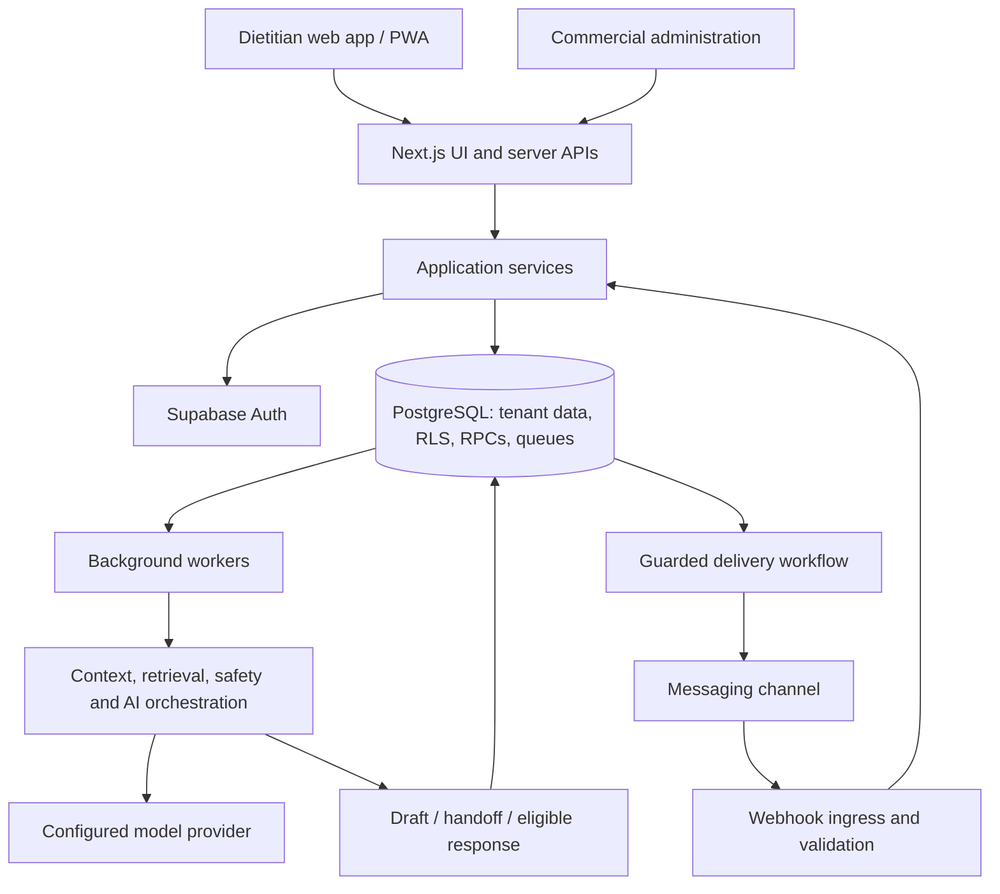

# AIya

### An AI-assisted workspace for dietitians and nutrition care teams

AIya brings client records, nutrition plans, conversations, and AI assistance into one professional workspace. It helps dietitians maintain continuity between consultations, prepare context-aware responses, and identify conversations that need personal attention.

The dietitian stays in control of care. AI assistance operates within each client's context, the practitioner's communication preferences, and explicit safety and approval rules.

[Website](https://aiyaworkspace.com) · [Architecture](#architecture) · [Local development](#local-development) · [Documentation](#documentation)

## The Product

Nutrition care extends beyond an appointment: clients ask questions, share meals, send voice messages, and need guidance grounded in their individual plan. AIya connects these interactions to the dietitian's workspace so that client context and professional oversight remain part of the conversation.

| Capability | What it supports |
| --- | --- |
| Client management | Client profiles, assignments, nutrition forms, food rules, menu plans, and structured context updates. |
| Conversation workspace | Conversation lists, message history, unread tracking, manual replies, drafts, and human takeover. |
| Professional AI assistant | Context-aware drafting, source-backed answers, conversation memory, and internal AI Chat with source and risk inspection. |
| Communication profiles | Persona selection and dietitian voice preferences that shape language, empathy, uncertainty, and response boundaries. |
| Media workflows | Queued image analysis, audio transcription, correction workflows, and retention/deletion processing. |
| Alerts and notifications | Review queues for risk, handoff, and structured-update events, linked to the relevant client context. |
| Mobile workspace | Responsive web access and an installable PWA with release-aware updates and privacy-conscious caching. |
| Business administration | Customer invitations, onboarding, workspace access, entitlement management, and commercial audit records. |

These capabilities describe the repository's implementation scope. Live integration availability depends on environment configuration and release approval; see [Release status](#release-status).

## How AI Assistance Works

1. **Establish context.** Resolve the tenant, practitioner, client, conversation, and current access and activation state.
2. **Prepare the request.** Combine permitted client context, conversation memory, relevant knowledge, and the selected communication profile.
3. **Evaluate safety.** Apply risk classification, scope restrictions, and answerability checks before choosing an action.
4. **Generate or escalate.** Produce an eligible response or review draft, or hand the conversation over to the dietitian.
5. **Validate the result.** Apply response-quality and safety checks before making the output available to the delivery workflow.

The conversation engine uses three risk levels:

| Risk level | Intended behavior |
| --- | --- |
| Green | Eligible low-risk assistance. Automatic delivery additionally requires an enabled operating mode and applicable delivery controls. |
| Yellow | Draft for professional approval. |
| Red | Human handoff; the red-risk conversation path does not call the LLM. |

Personas govern tone, vocabulary, empathy, and how uncertainty is expressed. They do not override clinical safety, tenant access, or human-control rules. AIya supports professional judgment; it is not an autonomous diagnosis or prescribing system.

## Architecture

AIya combines a Next.js application with a reusable JavaScript AI orchestration package. Server-side services coordinate authentication, domain operations, persistence, and asynchronous work. Supabase supplies authentication and PostgreSQL; SQL migrations define database contracts, row-level security policies, and RPC functions.



The diagram describes component responsibilities. Provider and channel connections require separately configured live integrations.

### Technology Stack

| Layer | Implementation |
| --- | --- |
| Application | Next.js 16 App Router, React 19, TypeScript |
| Interface | Tailwind CSS, Lucide icons, responsive layouts, PWA service worker |
| Identity and data | Supabase Auth, PostgreSQL, row-level security, versioned SQL migrations |
| AI orchestration | Local `dietitian-ai-assistant` package plus application-side retrieval, context, and provider services |
| Background processing | Node.js worker entry points for media, audio, AI Chat, and lifecycle operations |
| Verification | Vitest, Node.js tests, Playwright, axe accessibility checks, ESLint, production TypeScript checks |
| Deployment | Next.js standalone artifacts, release manifests, Nginx templates, PM2, GitHub Actions |

### Integration Boundaries

- **Messaging:** WhatsApp-first application integration with webhook and delivery controls. The core package separates channel adapters from conversation logic. Telegram-oriented core support does not establish an active production Telegram service.
- **AI providers:** Provider calls use explicit configuration and runtime gates. The current provider direction is direct Z.ai integration; historical package documentation retains older model references.
- **Commercial operations:** Invitations and manual entitlement operations sit alongside Stripe checkout, webhook, and billing-portal paths. Live payment processing requires separate configuration and approval.

## Security and Data Boundaries

Tenant identity is part of the application and database contracts. Server-side authorization, row-level security policies, and scoped RPCs govern access to client records and operational data. Commercial administration has separate authorization boundaries.

The implementation includes:

- Session validation and activity controls for authenticated workflows.
- Revision checks and idempotency handling for supported mutations and message-processing paths.
- Queue claim, lease, retry, and terminal-state handling for background work.
- Human takeover and risk locks controlling when AI may act on a conversation.
- Media access, retention, deletion, and correction workflows.
- PWA caching rules that keep authenticated navigation and API responses network-only.

The PWA is not an offline copy of the client database. Static assets can be cached; sensitive workflows depend on authenticated backend access.

These are engineering controls, not a regulatory certification. Data handling and recovery procedures are documented in the [data inventory](docs/DATA_INVENTORY.md) and [backup and restore runbook](docs/BACKUP_RESTORE_RUNBOOK.md).

## Repository Structure

```text
app/
  src/app/                 Product pages and server API routes
  src/components/          UI components
  src/lib/                 Application services and domain contracts
  supabase/                Database configuration and SQL migrations
  scripts/                 Workers, verification, and release tooling
  tests/                   Browser and integration-oriented tests
  public/                  Static assets, manifest, and service worker
dietitian-ai-assistant/
  src/                     AI orchestration, personas, context, and safety
  tests/                   Core tests and clinical evaluation fixtures
tools/                     Deployment, backup, and system audit utilities
docs/                      Technical specifications, runbooks, and evidence
```

The application consumes `dietitian-ai-assistant` as a local package. Keep both directories together. Run application npm commands from `app/`; the repository root is not the primary npm workspace.

## Local Development

### Prerequisites

- Git and Node.js 22 with npm, matching the CI runtime.
- Docker for local Supabase services when exercising database-backed workflows.
- A checkout containing both `app/` and `dietitian-ai-assistant/`.

### Install and Configure

From the repository root:

```bash
cd app
npm ci
```

Create `app/.env.local` from the tracked [environment template](app/.env.local.example) if it does not already exist. Preserve existing configuration. The template includes placeholders and development settings; it is not a production configuration.

For a local Supabase instance, run from `app/` with Docker running:

```bash
npx supabase start
npx supabase migration up --local
npx supabase status
```

Use the local instance's URL and keys to configure `NEXT_PUBLIC_SUPABASE_URL`, `NEXT_PUBLIC_SUPABASE_ANON_KEY`, and `SUPABASE_SERVICE_ROLE_KEY`. Keep the service-role key server-side. Do not commit `.env.local` or copy credentials into logs or documentation.

Set `NEXT_PUBLIC_APP_URL` to the local origin you use, and register its `/auth/callback` URL in Supabase Auth's redirect configuration. Password and email-link login require configured authentication; commercial administration also requires a reachable, migrated database and authorized admin configuration.

The template's `MANU_DEV_FALLBACK_STORE` option supports demo workflows. It does not replace Supabase for commercial administration or validate database isolation. Keep real provider and payment integrations disabled for ordinary local development.

### Start the Application

```bash
npm run dev
```

Open [localhost:3000](http://localhost:3000), or the port reported by Next.js. Use the same origin consistently in application and authentication configuration.

### Verify Changes

From `app/`:

```bash
npm run lint
npm run typecheck
npm test
npm run build
```

Run the AI package's core tests separately:

```bash
cd ../dietitian-ai-assistant
npm test
```

Database policy checks use `npm run test:rls` from `app/` and require their local database prerequisites. Browser checks use `npm run test:visual` and require Playwright browsers and the configured test environment.

The default application test command excludes the Supabase RLS integration suite. A passing unit suite therefore does not establish database isolation or deployment readiness.

## Releases and Operations

The application builds as a Next.js standalone package. Release tooling binds a commit SHA, migration fingerprint, release ID, compatibility version, and archive checksum into manifests. The `/api/health/release` route exposes identity fields for comparison with the intended deployment.

Workflow definitions and deployment tooling live in [.github/workflows](.github/workflows) and [tools/hosted-sandbox/deploy](tools/hosted-sandbox/deploy). Worker processes have separate entry points and operating requirements; building the web application does not start them.

### Release Status

AIya is in pre-launch development. The recorded production decision remains **NO-GO** pending owner-controlled integration, environment, operational, and release-approval requirements. Local tests, audit closure, and dry-run artifacts do not establish that a live environment runs the same code or that external integrations are enabled.

Physical iPhone Safari/PWA validation is recorded as **WAIVED_NOT_EXECUTED**, with accepted residual iOS risk. See the [release decision](docs/PRODUCTION_READINESS_STAGE_1_FINAL_DECISION.json), [owner handoff](docs/PRODUCTION_READINESS_STAGE_1_OWNER_HANDOFF.md), and [device validation decision](docs/OWNER_IOS_VALIDATION_WAIVER_DECISION.md) for recorded scope and outstanding requirements.

## Documentation

| Resource | Purpose |
| --- | --- |
| [Data inventory](docs/DATA_INVENTORY.md) | Data categories and handling boundaries |
| [Backup and restore runbook](docs/BACKUP_RESTORE_RUNBOOK.md) | Recovery procedures and verification |
| [Worker and release operations](docs/PRODUCTION_READINESS_STAGE_1_PHASE_5_OPERATIONS_RUNBOOK.md) | Worker startup and release operations |
| [Risk register](docs/RISK_REGISTER.md) | Recorded risks and mitigations |
| [Technical documentation](docs/) | Specifications, decisions, and historical evidence |
| [Maintainer handoff](HANDOFF_FOR_NEXT_CODEX.md) | Development continuity and execution context |

Historical implementation names such as `MANU_*` environment variables and `siriusai` cache identifiers remain in compatibility contracts. The product name is **AIya**.

## Contact

Product inquiries: [contact@aiyaworkspace.com](mailto:contact@aiyaworkspace.com)

No open-source license is currently included at the repository root. Contact the maintainer for permission to use or redistribute the code.
