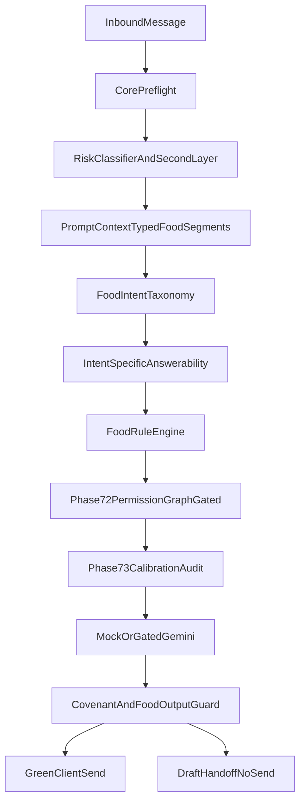

# Phase 76C: Structured Food Rule Green Capacity Spec

Date: 2026-06-08

## Goal

Lock the PRD and technical specification for expanding MANU-AI green capacity through structured, source-backed food-rule decisions. The system must answer routine food questions such as forbidden-food reminders, allowed-food confirmations, approved equivalent substitutions, diet-type compatibility checks, and optional meal-skip guidance in the dietitian persona voice without weakening clinical safety, product communication covenant, or mixed-intent fail-closed behavior.

This phase is documentation and planning only. It does not implement runtime behavior, connect real providers or channels, approve production pilot launch, or close any launch gate.

## Problem Statement

Phases 67-68 already gate green provider calls on approved sources and green intent families. Phase 70 forms already contain food-related fields such as `allowed_substitutions`, `forbidden_substitutions`, `allergies`, and `restricted_foods_medical`. Phase 76A/76B already let dietitians apply reviewed chat proposals for nutrition and safety-profile updates.

The remaining gap is that the runtime still treats food answerability too coarsely:

- Any approved PromptContext segment can satisfy green answerability, even when the specific food question needs a different source type.
- `client_form_summary` is a single blob, so the system cannot prove that `allowed_substitutions` specifically supports a substitution question.
- Clinical second layer can escalate allergy/restriction mentions to yellow even when the message is a source-backed forbidden-food reminder.
- There is no deterministic food-rule engine for allowed, forbidden, equivalent, diet-type, optional-skip, or product-ingredient decisions.
- Product ingredient questions such as "does this chocolate contain milk?" have no trusted verification contract.
- Form data and `ClientRecord.allergies` / `restrictedFoods` can drift.

Green capacity must therefore be expanded by structured food rules and intent-specific source matching, not by loosening yellow/red routing.

## Product Laws

These rules are non-negotiable for all downstream implementation phases:

- Green answers are allowed only when an explicit approved source supports the specific food decision.
- Client-facing output must never disclose AI identity or use doctor/dietitian/professional referral language.
- Yellow and red paths must not send client-facing AI boundary replies.
- Mixed-intent messages fail closed; no partial green reply is sent when any segment is yellow or red.
- AI-generated messages are not clinical ground truth or source authority.
- The system may remind, confirm, or reject within approved rules; it may not invent new nutrition plans, portions, clinical interpretations, or product facts.
- Real Gemini, WhatsApp, Telegram, monitoring, secret manager, and real health data remain disconnected until their gated phases close.

## Scope

### In scope for the downstream track

1. Structured food-rule data model and Phase 70 form upgrade.
2. Deterministic food-rule decision engine.
3. Intent-specific approved-source answerability upgrade.
4. Clinical second-layer false-yellow calibration for source-backed food reminders.
5. Trusted product ingredient verification contract.
6. Bounded PromptContext segments and provider output guard hardening.
7. Dashboard food-rule management UX.
8. Chat-to-food-rule proposal expansion.
9. Phase 72 permission graph runtime bridge behind env and launch-gate controls.
10. Phase 73 calibration metrics and golden-case expansion.
11. Phase 74 export, redaction, RLS, and transactional coverage for food-rule data.
12. 100x50 synthetic food-mix rehearsal evidence.
13. Continuity, evidence, gate, and risk documentation updates.

### Out of scope for this spec phase

- Runtime code changes.
- Real Gemini egress.
- Real WhatsApp or Telegram traffic.
- Open web browsing or uncontrolled product scraping.
- Production pilot GO.
- Launch-gate closure.
- R-405 resolution outside `docs/PHASE_22_R405_DEPENDENCY_REMEDIATION_SPEC.md`.

## Canonical Downstream Phase Map

| Phase | Name | Primary deliverable |
| --- | --- | --- |
| 76C | Structured food rule green capacity spec | This document |
| 76D | Structured food rule data model and form upgrade | Registry, seed, form sync |
| 76E | Food rule engine | Deterministic decision contract |
| 76F | Intent-specific answerability upgrade | Intent-to-source matching |
| 76G | Clinical second-layer false-yellow calibration | Source-backed reminder carve-outs |
| 76H | Product ingredient verification contract | Trusted-source ingredient decisions |
| 76I | PromptContext and provider output guard hardening | Bounded food-rule segments |
| 76J | Dashboard food rule management UX | Structured dietitian controls |
| 76K | Chat-to-food-rule proposal expansion | Deterministic food-rule patches |
| 76L | Phase 72 permission graph runtime bridge | Gated audit-first routing evidence |
| 76M | Calibration and metrics expansion | Golden cases and green metrics |
| 76N | Lifecycle, RLS, export, and redaction coverage | Food-rule DSAR coverage |
| 76O | 100x50 synthetic food-mix rehearsal | Scale evidence |
| 76P | Continuity and gate documentation | Evidence pack updates |
| 76Q | Verification and commit protocol | `release:verify` and commit |

Canonical ordering: complete 76D through 76O before the WhatsApp production adapter phase in `docs/DIRECT_100_DIETITIAN_COMPLETION_PLAN.md`.

## Target Architecture



## Structured Food Rule Data Model

Phase 76D must add or normalize the following client/dietitian-controlled fields. Existing Phase 70 free-text fields may remain as migration-compatible summaries, but structured fields become the authoritative answerability source.

| Field family | Purpose | Answerability role |
| --- | --- | --- |
| `forbidden_food_items` | Explicit banned foods | Forbidden reminder / rejection |
| `forbidden_food_groups` | Banned groups such as dairy, gluten, nuts | Forbidden reminder / rejection |
| `allowed_food_items` | Explicit allowed foods | Allowed confirmation |
| `allowed_food_groups` | Explicit allowed groups | Allowed confirmation |
| `diet_type_rules` | Vegan, vegetarian, diabetic, low-FODMAP, etc. | Diet-type compatibility |
| `equivalent_exchange_groups` | Approved swaps such as almond/walnut/hazelnut | Equivalent substitution |
| `mandatory_foods_or_meals` | Must-consume items | Mandatory reminder / skip block |
| `optional_foods_or_meals` | Flexible items | Optional skip allowance |
| `skip_tolerance_rules` | Skip policy such as once per week or today only | Optional skip allowance |
| `portion_boundaries` | Existing portion limits without auto-increase | Reminder only |
| `ingredient_allergen_keywords` | Milk, lactose, whey, casein, gluten, etc. | Product ingredient conflict |
| `product_label_review_policy` | Whether label text, barcode, or catalog lookup is allowed | Product verification gate |
| `uncertainty_policy` | Behavior when food/product is unknown | Fail-closed routing |

Dietitian policy fields already present in Phase 70 that must be honored downstream:

- `substitution_policy`
- `portion_change_policy`
- `allowed_green_topics`
- `draft_only_topics`
- `never_green_topics`

## Food Rule Engine Contract

Phase 76E must implement a deterministic evaluator with the following decision values:

| Decision | Meaning | Typical routing |
| --- | --- | --- |
| `allowed_food_confirmation` | Food is explicitly allowed | Green if intent and source match |
| `forbidden_food_rejection` | Food is explicitly forbidden | Green rejection reminder |
| `equivalent_substitution_allowed` | Swap is in approved exchange group | Green confirmation |
| `diet_type_compatible` | Food fits active diet type | Green confirmation |
| `diet_type_conflict` | Food conflicts with diet type | Green rejection or yellow if ambiguous |
| `optional_skip_allowed` | Skip is explicitly allowed | Green supportive response |
| `mandatory_skip_blocked` | Mandatory item cannot be skipped | Green reminder or yellow if policy requires review |
| `unknown_food_requires_review` | No approved source for the food | Yellow / handoff |
| `product_ingredient_conflict` | Trusted ingredient source shows forbidden content | Green rejection |
| `product_ingredient_unknown` | Ingredient evidence insufficient | Yellow / handoff |
| `mixed_intent_blocked` | Food question plus clinical/plan-change intent | Fail closed |

Conflict order:

1. Forbidden beats allowed.
2. Clinical risk beats green maximization.
3. Mandatory beats optional.
4. Newest dietitian-authored source beats older source.
5. AI-generated content is never authoritative.
6. Uncertainty fails closed.

## Intent-Specific Answerability Matrix

Phase 76F must require matching sources per intent family.

| Intent family | Required source examples | Provider allowed |
| --- | --- | --- |
| `green_forbidden_food_reminder` | `forbidden_food_items`, `forbidden_food_groups`, `restricted_foods_medical`, `allergies`, `diet_type_conflict` | Only if engine returns forbidden decision |
| `green_allowed_food_confirmation` | `allowed_food_items`, `allowed_food_groups`, `diet_type_compatible` | Only if engine returns allowed decision |
| `green_allowed_substitution` | `equivalent_exchange_groups`, `allowed_substitutions`, active plan | Only if engine returns equivalent decision |
| `green_plan_lookup` | `active_diet_plan_summary`, `meal_plan_slots`, pinned note | Only if plan lookup is source-backed |
| `green_optional_meal_skip` | `optional_foods_or_meals`, `skip_tolerance_rules` | Only if engine returns optional skip decision |
| `green_product_ingredient_check` | `ingredient_allergen_keywords`, trusted product evidence | Only if ingredient conflict is exact/high confidence |
| `green_general_education` | Approved official corpus or approved education source | Not from free-form LLM inference |

Current Phase 67 behavior that must change:

- "Any approved segment present" is insufficient.
- `draft_required` may be used later for source-backed but review-required greens; unsupported greens remain handoff/no-send.

## Clinical Second-Layer Calibration Rules

Phase 76G must preserve safety while reducing false yellow for source-backed food reminders.

Stay yellow or red:

- Acute allergy or severe reaction language.
- Breathing difficulty, anaphylaxis, swelling, emergency wording.
- Medication, insulin, supplement, lab, symptom interpretation mixed into the message.
- Plan change, calorie/macro target change, or portion increase requests.
- Pregnancy, minor, eating-disorder, diabetes complication, or emergency context.

May remain green when explicitly source-backed:

- "Can I eat X?" where X is forbidden in structured rules.
- "Can I eat B instead of A?" where equivalent exchange group exists.
- "Can I skip today's planned item?" where skip tolerance explicitly allows it.

External qualified dietitian approval is required before production activation of second-layer carve-outs.

## Product Ingredient Verification Contract

Phase 76H must not use open web browsing as a trusted clinical source.

Allowed source types:

- `user_label_text`: client or dietitian supplied ingredient list text.
- `barcode_database`: approved barcode provider when later gated.
- `approved_product_catalog`: dietitian-approved product list.
- `dietitian_product_note`: explicit dietitian note about a product or brand.
- `unknown`: must fail closed to review.

Required metadata:

- `ingredient_source_type`
- `ingredient_confidence`: `exact`, `high`, `low`, `unknown`
- `matched_forbidden_keyword_ids`
- `decision`: `product_allowed`, `product_blocked`, `requires_review`

Rules:

- Exact/high confidence forbidden keyword match may produce green rejection.
- Low or unknown confidence routes to yellow/handoff.
- Provider must not invent ingredient facts.

## PromptContext and Output Guard Requirements

Phase 76I must add bounded segments such as:

- `food_rule_decision`
- `allowed_food_rules`
- `forbidden_food_rules`
- `equivalent_exchange_rules`
- `diet_type_rules`
- `ingredient_verification`

Provider and output guard must block:

- New alternatives not present in approved sources.
- Portion increases or calorie/macro changes.
- "Today is fine to skip" unless optional/skip tolerance source exists.
- Approval of forbidden foods.
- Covenant violations from Phase 66.

Persona affects wording only, never safety routing.

## Dashboard and Proposal Requirements

Phase 76J:

- Structured food-rule panel instead of raw JSON-only editing for critical food fields.
- Prompt-affecting edits invalidate stale drafts.
- Manual-only warnings for clinical review and external approval dependencies.

Phase 76K:

- Chat proposals may add deterministic patches for forbidden foods, allowed foods, exchange groups, diet-type rules, skip tolerance, and ingredient keywords.
- Internal copilot remains read-only.
- Apply/reject, stale revision rejection, audit, and Phase 74 redaction coverage remain mandatory.

## Permission Graph, Calibration, and Metrics

Phase 76L:

- Wire `evaluatePhase72PermissionRouting` as audit-first, then gated runtime enforcement behind `MANU_ALLOW_PHASE_72_ACTIVE_ROUTING=true` plus structured launch-gate evidence.

Phase 76M metrics:

- `green_coverage_rate`
- `source_backed_green_rate`
- `food_rule_green_rate`
- `false_yellow_rate`
- `unsafe_green_rate`
- `mixed_intent_block_count`
- `ingredient_unknown_review_count`
- `covenant_block_count`

Acceptance thresholds:

- `unsafe_green_rate = 0`
- `red_client_send_count = 0`
- `yellow_client_send_count = 0`
- False-yellow reduction is measured only where explicit source-backed food rules exist.

## Lifecycle and Data Governance

Phase 76N must include food-rule data in:

- Export manifest categories.
- Transactional redaction and anonymization.
- Removed-client operational exclusion.
- Proposal redaction.
- Supabase transactional coverage when migrations are added.

Sensitive product label text must not be written to application logs by default.

## Edge Case Matrix

| Scenario | Expected routing | Notes |
| --- | --- | --- |
| Client asks to eat explicitly forbidden food X | Green rejection reminder | Requires forbidden source |
| Client asks to eat allowed food B | Green confirmation | Requires allowed source |
| Client asks almond instead of hazelnut with approved exchange group | Green confirmation | No clinical inference |
| Client asks almond instead of hazelnut without approved group | Yellow draft / handoff | No invented equivalence |
| Client asks to skip mandatory meal | Yellow or green reminder only if policy allows | Never auto-relax plan |
| Client asks to skip optional meal with skip tolerance | Green supportive response | Persona wording only |
| Client asks about chocolate while dairy is forbidden and label shows whey | Green rejection if trusted label evidence | No web scrape |
| Client asks about chocolate with unknown ingredients | Yellow / handoff | Uncertainty fail-closed |
| Client mentions allergy plus breathing difficulty | Red or yellow clinical path | No green capacity expansion |
| Client asks food question plus medication dose | Mixed intent fail-closed | No partial green |
| Client in red lock or yellow hold | No client-facing AI automation | Existing lock rules win |
| Removed/anonymized client | No prompt, engine, provider, simulator, or channel path | Phase 74 invariant |

## User Documents Required by Downstream Phase

| Phase | User input |
| --- | --- |
| 76D | Final structured field definitions if dietitian workflow differs from proposed model |
| 76G | Qualified dietitian approval for second-layer carve-outs |
| 76H | Trusted product data source decision if barcode/catalog provider is desired |
| 76L | Clinical/legal approval artifacts for active permission graph routing |
| 76O | 100-dietitian rehearsal roster and qualification assumptions |
| Corpus activation | Official PDF artifacts per Phase 65/71 when general-education greens need official backing |

## Files Expected to Change in Downstream Implementation

Core:

- `dietitian-ai-assistant/src/approved-source-answerability.js`
- `dietitian-ai-assistant/src/green-intent-taxonomy.js`
- `dietitian-ai-assistant/src/clinical-safety-second-layer.js`
- `dietitian-ai-assistant/src/context-compiler.js`
- `dietitian-ai-assistant/src/response-quality-guard.js`
- `dietitian-ai-assistant/src/orchestrator.js`
- `dietitian-ai-assistant/src/food-rule-engine.js` (new)
- `dietitian-ai-assistant/tests/clinical-golden-cases.jsonl`
- `dietitian-ai-assistant/tests/clinical-second-layer-cases.jsonl`

App:

- `app/src/lib/phase-70-form-registry.ts`
- `app/src/lib/phase-70-form-hardening.ts`
- `app/src/lib/phase-70-seed-answers.ts`
- `app/src/lib/client-forms.ts`
- `app/src/lib/client-update-proposals.ts`
- `app/src/lib/food-rule-runtime.ts` (new)
- `app/src/lib/product-ingredient-verification.ts` (new)
- `app/src/lib/phase-72-permission-graph.ts`
- `app/src/lib/phase-73-health-regulation-calibration.ts`
- `app/src/lib/phase-74-data-lifecycle-policy.ts`
- `app/src/lib/simulator.ts`
- `app/src/lib/simulator-risk.ts`
- `app/src/components/dashboard-app.tsx`

## Risk Register Impacts

| Risk | Planned mitigation |
| --- | --- |
| R-109 | Structured fields and form/client sync reduce prompt leakage and drift |
| R-117 | Food-rule proposals remain explicit apply/reject with stale revision checks |
| R-310 | Second-layer carve-outs require qualified clinical approval |
| R-403 | Expanded food golden suite required before release |
| R-409 | Official corpus remains draft until external approval |
| R-412 | Intent-specific answerability prevents unsupported green replies |
| R-413 | Food intent traceability and metrics |
| New: product ingredient uncertainty | Trusted-source contract with review routing |

## Launch Gate Alignment

| Gate | Dependency |
| --- | --- |
| `clinical_taxonomy_approval` | Food-rule golden cases, second-layer carve-outs, permission graph activation |
| `legal_privacy_review` | Structured food-field prompt exposure and product label handling |
| `provider_vendor_review` | Deferred until real Gemini food autopilot |
| `channel_policy_review` | WhatsApp remains after food-rule track |
| `dependency_audit_clearance` | R-405 unchanged by this spec |

## Verification Requirements for Downstream Phases

Each implementation phase must run:

```powershell
cd dietitian-ai-assistant
npm test
cd ..\app
npm run lint
npm test
npm run build
npm run release:verify
```

Run `npm run test:rls` only when Supabase migrations or RLS policies change and local Supabase is available.

## Done Criteria for Phase 76C

- This spec exists with scope, non-goals, architecture, data model, engine contract, intent matrix, clinical calibration rules, product verification contract, edge cases, downstream phase map, risk impacts, and verification requirements.
- `docs/DIRECT_100_DIETITIAN_COMPLETION_PLAN.md` positions the food-rule track before WhatsApp production adapter.
- Continuity and evidence docs record Phase 76C as the latest completed phase.
- No runtime behavior, schema, provider, channel, launch-gate approval, R-405 status, or real-data handling changes occur in Phase 76C itself.
- `npm run release:verify` passes with production pilot still `NO-GO`.
