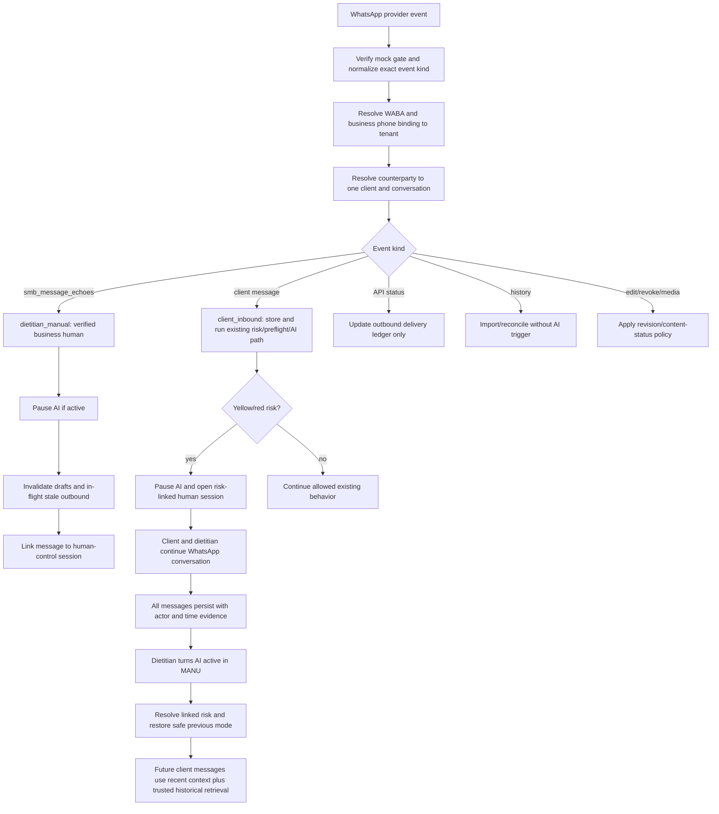

# Phase 85 Interstage Foundation - Trusted Clinical Communication And Memory Plan

Date: 2026-07-10
Canonical code: `P85-IF`
Status: Planning complete; P85-IF-A, P85-IF-B, and P85-IF-C complete; P85-IF-D next.
Placement: Phase 85 Stage 4A complete -> P85-IF -> Phase 85 Stage 4B.
Production pilot: `NO-GO`.
Deployment: none.

## 1. Program Position And Purpose

P85-IF is an independent, cross-cutting foundation program inserted between Phase 85 Stage 4A and Stage 4B. It does not replace Phase 85, complete Phase 85, or become a new top-level numbered phase. After P85-IF closes, execution returns to Phase 85 Stage 4B Uyarilar ve Bildirimler.

The program exists because the Stage 4B alert/notification experience cannot be built safely on the current channel and memory semantics. The current code can model correct provenance after a message is already labeled, but the WhatsApp ingestion boundary cannot yet prove whether a direct event was written by the client or by an authorized human using the WhatsApp Business App. The current AI context also uses a bounded recent-message window, so database transcript completeness does not guarantee that an older dietitian instruction reaches the model.

P85-IF therefore establishes the trusted foundation for:

- complete WhatsApp transcript persistence;
- tenant, client, conversation, channel-account, and actor resolution;
- verified business-human versus exact-dietitian attribution;
- human/AI coordination and stale-send prevention;
- full-history, provenance-preserving retrieval;
- explicit risk resolution through the authenticated AI reactivation action;
- controlled off-channel information intake through AI Chat;
- Stage 4B alert versus notification semantics;
- audit, export, redaction, RLS, replay, and operational evidence.

## 2. Locked Product Decisions

1. Every supported WhatsApp message is stored in the correct tenant/client/conversation transcript, whether AI is active, risk-paused, or manually paused.
2. The five canonical message origins remain unchanged: `client_inbound`, `ai_generated`, `dietitian_manual`, `system_event`, and `imported_unknown`.
3. Actor proof is two-layered. A Business App echo proves an authorized business-side human, but not necessarily a specific individual. Exact `authorDietitianId` is written only when an authenticated MANU action or an exclusive verified account policy proves it.
4. `smb_message_echoes` represents a WhatsApp Business App or linked-device human message. It is not an AI echo. API outbound correlation remains in the send/delivery ledger and status webhook path.
5. A verified external human message never runs the client inbound AI/risk pipeline. It is stored as `dietitian_manual`, invalidates stale work, and cannot trigger an AI reply loop.
6. If a verified dietitian/business-human message arrives while AI is active, the system automatically pauses AI and opens a human-control session.
7. Yellow/red risk pauses can be resolved only by an authenticated dietitian turning AI active again. That single action closes the linked risk state and reactivates AI; notification read/ack and WhatsApp messages alone never resolve risk.
8. Risk reactivation restores the pre-lock mode. Autopilot restoration still requires the existing mandatory safety gates; otherwise the system falls back to copilot.
9. All transcript content remains in the database, but the full transcript is never injected raw into every prompt. Query-time, tenant/client-scoped historical retrieval selects relevant evidence from the complete transcript.
10. A relevant newer WhatsApp dietitian instruction temporarily outranks older structured form/plan/menu context. The system creates a non-risk notification asking the dietitian to update the relevant structured panel.
11. Alerts are yellow/red clinical risk events. Notifications are system information such as structured-record update requests, channel trust degradation, or unsupported-content review.
12. Off-channel information enters through AI Chat as a proposal. Context-only information can be committed after explicit dietitian confirmation. Form, active nutrition plan, food-rule, or menu changes cannot be committed until the corresponding dashboard records are manually updated and re-confirmed.
13. The general internal copilot remains read-only. Only the dedicated, capability-gated context-intake workflow may create and apply a reviewed `ClientContextUpdate` proposal.
14. Real WhatsApp, Telegram, Gemini/provider, live billing, monitoring, backup, secret manager, and real health-data paths remain disconnected throughout P85-IF.

## 3. Target End-To-End Flow

## 4. Program Structure

| Track | Scope | Runtime status |
| --- | --- | --- |
| P85-IF-A | Canonical spec, provider contract, threat model, state machines | Complete |
| P85-IF-B | Trust-root, provenance, identity, event, and session data model | Complete |
| P85-IF-C | Secure mock webhook, normalization, ledger, routing, quarantine | Complete |
| P85-IF-D | Complete transcript, human-control coordination, edit/revoke/media | Pending |
| P85-IF-E | Full-history retrieval, prompt authority, answerability relevance | Pending |
| P85-IF-F | Yellow/red resolution, direct AI reactivation, concurrency safety | Pending |
| P85-IF-G | Controlled off-channel AI Chat context intake | Pending |
| P85-IF-H | Minimal operational visibility and Stage 4B contract handoff | Pending |
| P85-IF-I | Lifecycle, RLS, export, evidence, verification, closure | Pending |

## 5. P85-IF-A - Canonical Contract And Threat Model

### Objective

Create `docs/PHASE_85_INTERSTAGE_TRUSTED_CLINICAL_COMMUNICATION_MEMORY_SPEC.md` as the implementation contract. No runtime code changes occur in this track.

Status: complete on 2026-07-10. The canonical spec now exists at `docs/PHASE_85_INTERSTAGE_TRUSTED_CLINICAL_COMMUNICATION_MEMORY_SPEC.md`; P85-IF-B is also complete and P85-IF-C is next.

### Required specification content

- Exact provider event matrix for `messages`, `statuses`, `smb_message_echoes`, `history`, edit, revoke, media, malformed, batch, duplicate, and unsupported events.
- Actor-resolution truth table covering client, exact dietitian, verified business human, AI outbound, system, and unknown actor.
- Tenant resolution order: provider/WABA/business-phone binding first; client/counterparty identity second; actor third; conversation fourth.
- Fail-closed matrix for unknown account, unknown client, multiple clients, actor conflict, revoked binding, unsupported media, invalid timestamp, malformed event, and cross-tenant collision.
- Human-control session state machine for manual pause, external human auto-pause, yellow hold, red lock, and direct AI reactivation.
- Prompt authority and temporal precedence contract for structured records, context updates, recent messages, retrieved historical messages, edited/revoked content, and imported unknown content.
- Off-channel AI Chat proposal state machine and structured-update prerequisite.
- Stage 4B handoff boundary: P85-IF defines data/API semantics and minimal evidence UI only; Stage 4B owns the complete alert/notification center, filters, list ergonomics, mobile/PWA experience, and final visual design.

### Acceptance

- Spec, threat model, edge-case matrix, schema/API contract, subtrack acceptance criteria, and verification commands are complete.
- Production `NO-GO`, R-405 open, and R-406 pending are preserved.
- `git diff --check` and secret scan are clean.

## 6. P85-IF-B - Trust Root And Provenance Data Model

### Canonical records

- `ChannelAccountBindingRecord`: provider, WABA ID, business phone-number ID, normalized display number, tenant, operating mode, active/revoked lifecycle, verification timestamps, and `exclusive_dietitian | shared_authorized_team` policy.
- `ChannelActorBindingRecord`: tenant, account binding, optional dietitian, actor type, attribution basis, valid-from/to, verified/revoked metadata, and audit ownership.
- `ChannelEventRecord`: exact event kind, provider account/event/message IDs, from/to/counterparty identities, payload digest, provider time, observed time, processing status, quarantine link, retry/replay metadata, and internal sequence.
- `ChannelMessageRevisionRecord`: original message, edit/revoke action, provider event, prior/current content status, revision sequence, and timestamps.
- `HumanControlSessionRecord`: client, conversation, reason, previous AI state/mode, linked handoffs/holds/messages, response-observed counters, resolution/reactivation metadata, and lifecycle status.
- `RiskActivityEventRecord`: response observed, AI paused, draft invalidated, risk resolved, AI reactivated, and source evidence links.
- `ContextIntakeProposalRecord`: target client proof, source channel, source text, extracted context draft, structured-impact flags, baseline revisions, status, confirmation, and apply evidence.

### Message contract

`MessageRecord` gains provider account/message ID, actor type, actor binding, author interface, actor-resolution basis, `providerSentAt`, `observedAt`, `persistedAt`, `conversationSequence`, content status, and retrieval eligibility.

Database constraints enforce:

- origin/sender/author consistency;
- `dietitian_manual` requires exact dietitian proof or verified business-human proof;
- `ai_generated` requires an AI decision;
- client and conversation tenant consistency;
- actor/dietitian assignment consistency where exact attribution is claimed;
- canonical provider-message uniqueness;
- globally unique provider account routing identity;
- two-way client/business identity conflict rejection;
- soft revoke instead of destructive identity deletion.

### API and authorization

- Owner/admin can create, verify, activate, revoke, and inspect account/actor bindings.
- Dietitians can view bindings and request changes but cannot silently activate a trust root.
- Assistant/auditor cannot mutate bindings.
- Existing auth, entitlement, onboarding, billing, and PWA contracts remain unchanged.

### Acceptance

- Fallback and Supabase types/mappers/seeds are null-tolerant for legacy rows.
- Migration, RPC, RLS, RBAC, uniqueness, conflict, and tenant-isolation tests pass.
- No existing message behavior changes before P85-IF-C/D enable the new path.

Status: complete on 2026-07-10. P85-IF-B added app-level nullable provenance/message contract fields, canonical trust-root/event/revision/session/risk/context-intake records, Supabase mappers, append-only migration `app/supabase/migrations/20260710120000_phase_85_if_b_trust_root_provenance.sql`, and focused provenance model tests. Real provider/channel behavior remains disconnected. P85-IF-C is next.

## 7. P85-IF-C - Secure Ingress, Ledger, Routing, And Quarantine

### Normalization and security

- Normalization returns `NormalizedChannelEvent[]`; every entry/change/message in a batch is processed independently.
- Event kind is derived from the exact provider field, never inferred from message text.
- Mock webhook requires both the existing feature gate and `MANU_MOCK_WHATSAPP_WEBHOOK_SECRET`, refuses production execution, and remains disabled on the hosted sandbox.
- A future real adapter must verify Meta signatures before normalization; this remains an unimplemented production gate.

### Routing

1. Resolve provider account/WABA/business phone to one active tenant binding.
2. Resolve `to`/counterparty identity to one tenant-scoped client.
3. Verify client lifecycle, channel permission, and conversation relationship.
4. Resolve actor from event kind and trust binding.
5. Reject actor/client overlap, ambiguous identity, inactive binding, or assignment mismatch.

### Idempotency and quarantine

- Canonical event uniqueness and canonical message uniqueness are separate so status/edit/revoke events can reference an existing message without duplicating it.
- Event statuses are `received`, `normalized`, `quarantined`, `committed`, `duplicate`, `replayed`, `rejected`, and `expired`.
- Quarantined events are not terminally discarded. Authorized replay transitions the same event record and remains idempotent.
- Mock synthetic replay content has a seven-day expiry. Real clinical content cannot use this path until encryption, retention, and secret-management gates are externally approved.

### Acceptance

- Golden fixtures cover direct client message, business echo, status, history, edit, revoke, media, batch, malformed, unknown, ambiguous, conflict, duplicate, and replay.
- Two tenants with the same client phone remain isolated by provider account binding.
- No event reaches the orchestrator until tenant, client, actor, and conversation resolution all succeed.

Status: complete on 2026-07-10. `phase-85-if-c-channel-event-normalizer.ts` decomposes a mock WhatsApp Cloud-style webhook payload into independent `RawChannelEventCandidate` entries per entry/change/message/status/echo/history item, deriving the exact `ChannelEventKind` from provider fields only. `phase-85-if-c-channel-event-routing.ts` implements the mandatory fail-closed account-binding -> tenant -> counterparty/client -> lifecycle/channel -> actor -> conversation order, with exclusive/shared business-actor resolution and unknown-account/unknown-client/ambiguous-client/cross-tenant-collision/revision-unknown-target quarantine. `phase-85-if-c-channel-event-ledger.ts` adds the secure mock-webhook gate (`MANU_ALLOW_MOCK_WHATSAPP_WEBHOOK` plus `MANU_MOCK_WHATSAPP_WEBHOOK_SECRET`, refusing production and `MANU_HOSTED_SANDBOX_ACTIVE`), duplicate event/message idempotency, quarantine plus seven-day mock replay/expiry, and audit trail. Golden fixtures at `phase-85-if-c-channel-event-golden-cases.jsonl` cover 12 categories. Only fully-resolved `client_message_text` events delegate to the existing, unmodified `processMockChannelInbound` orchestrator path; this is an intentional, additive scope decision so the new engine does not change current client-facing behavior or require live-route rewiring in this track (no `ChannelAccountBindingRecord` is seeded by default, so flipping the live route would fail-closed the existing demo/tests). Storing business-human echoes as verified `dietitian_manual`, auto-pausing AI, and human-control session integration remain P85-IF-D scope. Supabase-side ledger persistence was deferred (not required by this track's acceptance criteria). Verification: targeted P85-IF-C Vitest 26/26, adjacent regression spot-checks green, lint 0 errors (3 pre-existing warnings, unchanged), `git diff --check` clean, secret/token scan clean, Phase 86 naming scan clean; a full `npm test`/`npm run build` re-run is still owed because the verification sandbox could not complete either (suite duration and an outbound Google Fonts network restriction unrelated to the code). P85-IF-D is next.

## 8. P85-IF-D - Complete Transcript And Human Control

### Client messages

- Client inbound is stored whether AI is active, risk-paused, or manually paused.
- Existing risk classification still runs for client inbound while AI is passive so a new red condition is not hidden.
- Preflight continues to block client-facing AI output while paused/locked.

### Business-human messages

- Business App/linked-device echo is stored as `sender=dietitian`, `origin=dietitian_manual`, `actorType=business_operator`, and `authorInterface=whatsapp_business_surface`.
- Exact `authorDietitianId` remains null for shared bindings; exclusive verified policy may supply it with an explicit attribution basis.
- The AI/risk pipeline is never invoked for this event.
- If AI is active, the event atomically pauses AI, opens a human-control session, increments conversation/context revision, invalidates drafts, and cancels stale outbound preparation.
- If AI is already passive, the event joins the existing session and records `human_response_observed`.

### Content lifecycle

- Edit creates an immutable revision and invalidates decisions/drafts that used the prior revision.
- Revoke marks the message non-promptable/non-answerable while retaining minimized audit evidence.
- Unsupported or textless media creates `content_unavailable`, pauses the affected client, and produces a review requirement; it never becomes approved clinical source text.
- History events reconcile by provider message ID, use provider timestamps, and never trigger new AI replies or risk decisions.

### Acceptance

- No client/dietitian actor inversion and no human-to-AI response loop.
- Full transcript remains ordered and queryable through active/passive/risk/manual sessions.
- Edit, revoke, media, history, draft invalidation, and auto-pause tests pass in fallback and Supabase paths.

## 9. P85-IF-E - Full-History Retrieval And Prompt Authority V2

### Retrieval architecture

- Fallback uses the existing deterministic lexical-retrieval pattern over the complete tenant/client conversation corpus.
- Supabase uses a tenant/client/conversation-scoped PostgreSQL full-text search RPC and index; it does not depend on the bounded app-state loader.
- Real embedding retrieval remains disconnected and launch-gated.
- Retrieval candidates exclude `imported_unknown`, revoked, unavailable, blocked, draft, and unverified-actor messages.

### Context Policy V2

- Existing maximum eight recent promptable messages remains.
- Historical retrieval adds at most six sources and at most 600 estimated tokens: up to four relevant dietitian/business-human sources and two supporting client/sent-AI sources.
- Ranking order is exact source/reference, shared clinical entity, deterministic lexical relevance, actor trust, provider time, and conversation sequence.
- Relevant newest dietitian evidence is never silently dropped for budget. If it cannot fit safely, generation blocks with missing/overflow historical context.

### Authority and answerability

- Generic `dietitian_manual_message` presence no longer satisfies answerability.
- Only a retrieval-evidenced `relevant_dietitian_manual_message` may support the matching intent.
- Generic greetings, unrelated logistics, and low-overlap messages cannot unlock plan/substitution/education answerability.
- Client-authored retrieved text remains untrusted data and stays inside client-data boundaries.
- Newer relevant WhatsApp dietitian instruction temporarily outranks older structured context.
- Explicit date/until/today wording is evaluated in the dietitian timezone; expired temporary instructions are excluded. Instructions without explicit expiry remain until superseded or the related structured record is confirmed updated.
- Ambiguous competing authoritative sources block only the affected intent and create a review notification.

### Structured update notification

- A detected WhatsApp change to form, active nutrition plan, food rules, or menu creates `structured_record_update_required`.
- The notification links the source message and target dashboard panel.
- It closes only after the related record revision changes and the dietitian confirms completion.
- This notification is not yellow/red risk and does not enter risk SLA calculations.

### Acceptance

- A dietitian instruction remains retrievable after more than eight later messages.
- A standalone `Merhaba` cannot satisfy a plan lookup.
- Temporal expiry, supersession, structured override, edit/revoke, cross-tenant isolation, and low-confidence fail-closed behavior are test-locked.

## 10. P85-IF-F - Risk Resolution, AI Reactivation, And Concurrency

### Session and resolution semantics

- Manual pause opens a non-risk human-control session.
- Yellow/red pause opens a risk-linked human-control session and records previous AI status/mode.
- WhatsApp response records human involvement but never resolves the risk.
- Notification read/ack remains notification state only.

### Direct AI activation rule

When an authenticated dietitian turns AI active:

- a manual-pause session closes without creating clinical-resolution evidence;
- an active yellow/red session resolves its linked hold/handoff;
- unused yellow drafts are invalidated as handled through external human conversation;
- red lock is marked reactivated and linked handoff is resolved;
- AI becomes active in the previous mode;
- unsafe autopilot restoration falls back to copilot;
- a fixed audit reason code records direct dietitian reactivation without an extra free-text form.

Existing red resolve/reactivate APIs remain backward-compatible. A unified controlled activation operation may orchestrate the existing red path and the new yellow/manual paths without weakening authorization or preflight.

### Concurrency and send safety

- Every conversation mutation increments a monotonic conversation revision.
- AI decisions and outbound records capture the revision used for generation.
- Before provider send/commit, compare-and-swap revalidation verifies the latest revision, promptable source IDs, risk lock, channel permission, and AI state.
- A concurrent human message, edit/revoke, new client inbound, context update, or risk transition cancels stale outbound work.
- A concurrent new red event prevents reactivation and returns a controlled conflict.

### Acceptance

- Yellow/red direct activation, manual resume, previous-mode restoration, copilot fallback, stale draft, stale outbound, and concurrent red/echo races are covered.
- No direct client patch can bypass the canonical risk-resolution operation.

## 11. P85-IF-G - Controlled Off-Channel AI Chat Intake

### Client resolution

- Global AI Chat requires normalized full name plus normalized E.164 phone and must resolve exactly one visible client.
- Client-scoped AI Chat uses the selected client ID but still presents name and phone confirmation.
- Zero, multiple, hidden, removed, or mismatched clients fail closed without a proposal.

### Proposal model

The proposal includes source (`phone`, `zoom`, `in_person`, `other`), occurred-at time, title, summary, details, importance, raw source reference, expected client context revision, structured-impact flags, and baseline form/plan/food-rule/menu revisions.

Statuses are `draft`, `awaiting_confirmation`, `blocked_pending_structured_update`, `ready_after_structured_update`, `applied`, `rejected`, `stale`, and `expired`.

### Context-only information

- AI Chat presents a structured preview.
- Explicit dietitian confirmation is mandatory.
- Apply creates only `ClientContextUpdate`, increments context revision, invalidates drafts, and records audit/source evidence.

### Structured information

- Form, active plan, food-rule, or menu impact moves the proposal to `blocked_pending_structured_update`.
- No client context update or automatic structured mutation occurs.
- AI Chat names the required panel and provides a deep link.
- The required record revision must increase before recheck.
- After revision evidence, the dietitian confirms again; apply creates a context update referencing the updated structured records.
- Pending structured impact blocks only affected intents until completed or explicitly rejected.

### Acceptance

- Wrong-client, ambiguous-client, pure-context, structured-block, revision recheck, double-confirmation, stale proposal, replay, RBAC, RLS, export, redaction, and draft invalidation tests pass.
- General copilot tools remain read-only outside this dedicated workflow.

## 12. P85-IF-H - Minimal Operational Visibility And Stage 4B Handoff

P85-IF-H implements only the visibility needed to operate and verify the new foundation:

- provenance labels for client, AI, exact MANU dietitian, and verified WhatsApp business human;
- a compact human-control session banner with pause reason, latest response time, and direct AI activation control;
- source-message links for structured update requirements;
- owner/admin trust-binding and quarantine inspection controls;
- safe aggregate channel trust counters and degraded/blocked state;
- seven-language strings required by these minimal controls.

P85-IF-H explicitly does not build the complete Stage 4B product experience. Stage 4B retains ownership of the alert/notification center, navigation, filters, grouping, prioritization, read/ack ergonomics, mobile/PWA behavior, final copy, and visual polish.

### Acceptance

- Minimal controls expose no raw health text in aggregate health surfaces.
- Desktop/mobile visual smoke verifies no overlap, overflow, or broken Stage 4A workflows.
- Existing auth, onboarding, billing, entitlement, admin, and PWA contracts remain unchanged.

## 13. P85-IF-I - Lifecycle, RLS, Evidence, Verification, And Closure

### Data lifecycle

- Client export version includes messages, revisions, human sessions, risk activity, retrieval source references, and applied/pending context-intake evidence where client-scoped.
- Anonymization/deletion redacts message bodies, provider IDs, counterparty identities, revision content, quarantine payloads, retrieval evidence, proposal source text, delivery copies, and session links.
- Audit retains only minimized hashes, reason codes, timestamps, and non-identifying aggregate evidence.
- Tenant account/actor bindings stay out of client export but participate in tenant revoke/deletion lifecycle.

### RLS and operational evidence

- RLS covers every new table, provider-account tenant routing, assignment scope, shared/exclusive actor policy, quarantine operations, retrieval RPC, and context-intake proposal.
- Local Supabase absence produces a documented skip and leaves R-406 pending; it never counts as closure.
- Risk register records actor-proof, silent webhook loss, stale structured records, retrieval false positives/negatives, quarantine retention, shared-device attribution, and concurrent human/AI sends.

### Verification chain

- targeted Vitest and core Node test suites;
- full `npm test`;
- `npm run lint`;
- `npm run build`;
- `npm run test:visual` for UI-affecting tracks;
- `npm run release:verify`;
- `npm run rehearse:channel:replay`;
- `npm run rehearse:production-scale:79g` where affected;
- `git diff --check`;
- secret/token scan;
- current local RLS suite when Supabase is available.

### Documentation and commit protocol

Each P85-IF track updates the required continuity documents and receives its own commit. P85-IF-I updates the complete evidence/dossier set and records that Stage 4B is again the next Phase 85 planning target.

No deploy occurs during P85-IF unless separately authorized. If a future sandbox deploy is explicitly approved, hosted evidence and Phase 84 hosted-sandbox notes must be updated separately.

## 14. Critical Acceptance Scenarios

1. AI is risk-paused; client and dietitian continue on WhatsApp; every message is stored with the correct actor; dietitian turns AI active; risk resolves and AI continues with trusted historical context.
2. Dietitian manually pauses AI before a WhatsApp conversation; the transcript is complete; resume closes only the manual session and does not create a false clinical-resolution event.
3. Dietitian forgets to pause AI; the first verified Business App echo atomically pauses AI and prevents a stale AI send.
4. A shared Business App account proves a business human but does not fabricate an individual dietitian author.
5. A dietitian instruction remains available after eight later messages; a generic greeting cannot satisfy answerability.
6. A newer WhatsApp instruction conflicts with the old menu/plan; WhatsApp temporarily wins and a non-risk structured-update notification is created.
7. Off-channel context-only information is proposed and applied after confirmation; structured changes remain blocked until the dashboard record revision changes.
8. Unknown/ambiguous actor, unsupported media, malformed event, revoked identity, cross-tenant collision, and replay remain fail-closed.
9. Edit/revoke invalidates stale prompt and outbound evidence.
10. Concurrent new red inbound prevents an outdated reactivation or client-facing send.

## 15. Problem-To-Track Traceability

| Problem | Closure track |
| --- | --- |
| Actor is unknown or same chat is mistaken for actor proof | P85-IF-A/B/C/D |
| Business App echo path is missing | P85-IF-C/D |
| Business account does not prove an individual dietitian | P85-IF-B/D |
| Tenant/client/counterparty routing is incomplete | P85-IF-B/C |
| Full database transcript is not full AI memory | P85-IF-E |
| Last-eight history loses older dietitian instructions | P85-IF-E |
| Unrelated dietitian message unlocks answerability | P85-IF-E |
| Human and AI can race or answer together | P85-IF-D/F |
| Notification/read/response/resolution semantics are conflated | P85-IF-F/H |
| Quarantine is terminal or unreplayable | P85-IF-C/I |
| Provider/event/message ledger is incomplete | P85-IF-B/C/I |
| Off-channel information can target the wrong client | P85-IF-G |
| Structured changes are applied without panel ownership | P85-IF-G |
| Data copies escape export/redaction/RLS coverage | P85-IF-I |

## 16. Program Definition Of Done

P85-IF closes only when:

- P85-IF-A through P85-IF-I are implemented and committed independently;
- no known actor/provenance branch silently defaults to client or dietitian;
- complete transcript persistence and historical retrieval are test-proven;
- risk resolution is tied to authenticated AI reactivation;
- human/AI concurrency is fail-closed at send time;
- off-channel intake is client-safe, reviewable, and unable to mutate structured panels;
- Stage 4B receives stable alert/notification contracts without P85-IF consuming its full UI scope;
- export/redaction/RLS/replay/operational evidence cover all new records;
- full verification is green except explicitly documented local Supabase skips;
- R-405 remains open unless independently remediated or accepted;
- R-406 remains pending without current local Supabase evidence;
- production pilot remains `NO-GO`;
- real providers, real channels, and real health data remain disabled.
